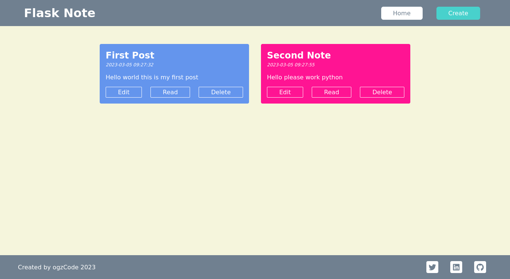
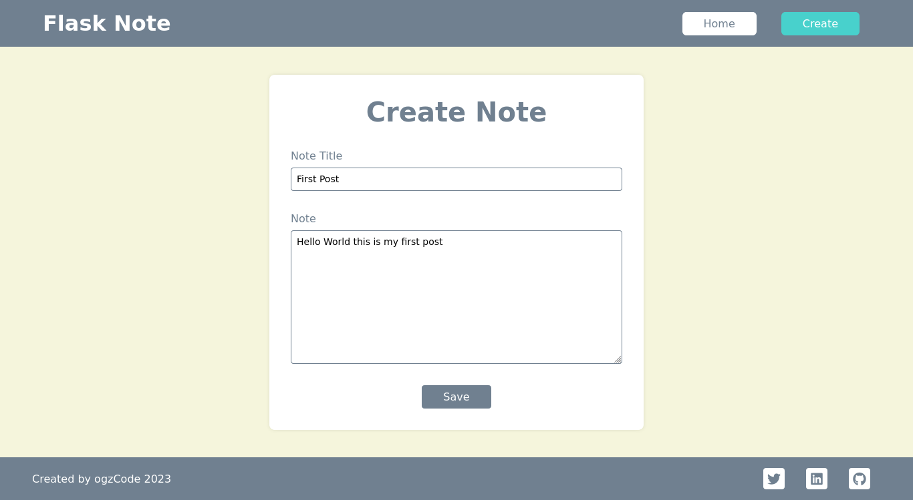

# Flask Note App
Python ve Flask kullanarak geliştirdiğim not uygulaması.SQLite veri tabanı aracılığı ve Flask ile not tutmanıza yarayacak bir web uygulaması.

## Uygulamanın Çalıştırılması
* Terminalden uygulamanın ana dizinine geçiş yapın
* Veritabanının oluşturulması için bu komutu yazın 
`python3 init_db.py`
* Bu komutu bir kez çalıştırmanız yeterlidir.
* Ardından aşağıdaki üç komutu çalıştırın.
```
export FLASK_APP=app
export FLASK_ENV=development
flask run
```


## Öğrendiklerim
* Flask te Javascript kullanımı
* SQLite bağlantısı kurma
* SQLite ile CRUD işlemleri gerçekleştirme
* CRUD işlemlerini Flask ve Template ile kullanma
* Dinamik route
* `include` ile bileşen tabanlı template kullanımı
<hr>

### Ekran Görüntüleri

#### Ana Sayfa


<hr>

#### Not Oluşturma Sayfası
